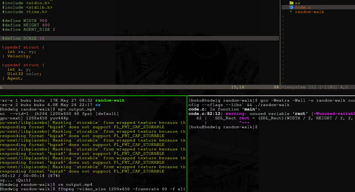

# Random Walk



## What is this?

Imagine you have a tiny ant standing in the middle of a big white paper. The ant doesn't know where to go, so it takes a random step — up, down, left, or right. Then another. And another. Slowly, the ant draws a pretty colorful scribble!

This program does the same thing — but with many colorful "ants" walking at the same time, making beautiful rainbow patterns.

## How to run

```bash
gcc -Wall -Wextra -o random-walk code.c `sdl2-config --cflags --libs`
```

You can also set how many walkers you want:

```bash
./random-walk 10   # 10 ants
./random-walk 100  # 100 ants!
```

Press **Q** to quit.
